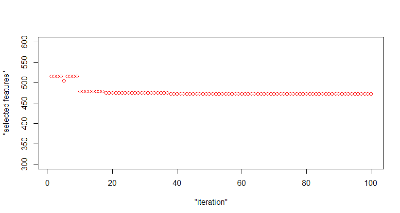

```{r setup, include=FALSE}
knitr::opts_chunk$set(echo = TRUE)
```

## Task 1: Maximization of a non-convex function

A variation of the Rosenbrock function we are interested in is defined as f(x, y) = (1 − x)^2 + e (y − x^2)^2.

1. A method f(x, y) that computes a value z, given an input tuple (x, y).

```{r echo=TRUE}
f <- function(x, y)
{
z <- (1-x)^2+exp(1)*(y-x^2)^2
z
}

```

2. A method that visualizes the Rosenbrock function in 3D, where x and y are in the interval [−1, 1].

```{r echo=TRUE}
library(rgl)
x <- seq(-1 ,1, length = 20)
y <- seq(-1, 1, length = 20)
z <- outer(x,y,f)

persp(x,y,z) -> res

```

3. A genetic algorithm, that attempts to find the global maximum of this function. 

The trace of evolution of each evaluation is plotted with the monitor function myMonitor. We have used different mutation and/or crossover settings.

The maximum value is plotted in green color (of GA). 


```{r}
myMonitor <- function(obj){
  persp(x,y,z) -> res
  title(paste("iteration =", obj@iter), font.main = 1)
  points(trans3d(obj@population[,-2], obj@population[,-1], obj@fitness, pmat = res), col="red")
  Sys.sleep(0.2)
}
```

```{r eval=FALSE, warning=FALSE, include=TRUE}
persp(x,y,z) -> res

GA <- ga(type = "real-valued", fitness = f, y, lower = c(-1,-1), upper = c(1,1), maxiter=500, crossover = gareal_blxCrossover, monitor = myMonitor)
a <- GA@solution[1]
b <- GA@solution[2]
c <- f(a,b)
points(trans3d(a,b,c, pmat = res), col = "green")
```

```{r eval=FALSE, warning=FALSE, include=TRUE}
persp(x,y,z) -> res

GA1 <- ga(type = "real-valued", fitness = f, y, lower = c(-1,-1), upper = c(1,1), maxiter=300, crossover = gareal_waCrossover, pmutation = 0.2, popSize = 30, monitor = myMonitor)
a <- GA1@solution[1]
b <- GA1@solution[2]
c <- f(a,b)
points(trans3d(a,b,c, pmat = res), col = "green")
```

```{r eval=FALSE, warning=FALSE, include=FALSE}
persp(x,y,z) -> res

GA2 <- ga(type = "real-valued", fitness = f, y, lower = c(-1,-1), upper = c(1,1), maxiter=200, crossover = gareal_laCrossover, pmutation = 0.3, monitor = myMonitor)
a <- GA2@solution[1]
b <- GA2@solution[2]
c <- f(a,b)
points(trans3d(a,b,c, pmat = res), col = "green")

```

4. Discussing the result:
The maximum value of the function (in the interval x ∈ [−1, 1] and y ∈ [−1, 1]) obtained from the algorithm is 14.8731, with x = 0.999 and y = -0,999. 

#### Number of iterations
The number of maximal iterations plays a big role in the performance of the algorithm. Let assume we use the default value for the population size (popSize = 50). For example, if in the first GA we use maxiter = 100, we get the "maximum" value: 9.141672. If we use maxiter = 200, we get: 14.8731. As we increase the number of iterations from 200, there is a high probability that the algorithm converges to the maximum value.

#### Population size
In the first GA we used the default population size of 50, however, the population size can influence how fast can the algorithm converge to the maximum value (fast, as in less iterations). This works best for using a small population size, because it increases the chance of finding better results and converging to global optimum. If we increase this value to 100, with the number of maximum iterations = 100, we get the wanted maximum value. However, if the population size is much larger than the number of iterations, it can prevent the algorithm to fully converge. For example, using a population size of 500, in 100 iterations we get the result: 4.146391. 

#### Local and global maxima
In a given interval, the local maxima of a function is its largest value. At different intervals, there can be different local maxima values. The global maxima of a function is the largest overall value of the function respectively, on the entire domain of a function. Therefore, there is only one global maxima.


## Task 2: Feature Selection 

In this task, for a given data set it is required to identify the most relevant features for a given classification problem. For the classifier we chose the accuracy value that is computed from the model in the three-fold cross validation process, defined in the trainControl function.

```{r eval=FALSE, warning=FALSE, include=TRUE}
library(caret)
library(lattice)
library(ranger)

#read data set
genes <- read.csv("DLBCL.csv", header = T, sep = ",")

#remove id attribute
genes[1] <- NULL

#split the dataset to training and testing
inTraining <- createDataPartition(genes$class, p = 0.70, list = FALSE)
training <- genes[ inTraining,]
testing  <- genes[-inTraining,]

#ploting the trace of evolution
#number of selected features for each interations
myMonitor <- function(obj){
  i <- which.max(obj@fitness)
  points(obj@iter, sum(obj@population[i,]),pmat = p, col = "red")
}

#fitness function
myFitness <- function(vector){

  n <- sum(vector)
  if (n >= 2 && n <= 1000){
    vector[length(vector)] = 1
    
    chosen <- training[,!!vector]
    
    train_control<- trainControl(method="cv", number=3, savePredictions = TRUE)
    
    model <- train(class~., data=chosen, trControl=train_control, method="ranger")
    
    matrix <- confusionMatrix(model)
    accuracy <- sum(diag(matrix$table))/100
    accuracy/n
    
  } else {
    0
  }
}

iter = 100
plot("iterations","selected features", xlim = c(1,iter), ylim=c(300,600), type="n") -> p

GA <- ga(type = "binary", fitness = myFitness, nBits = ncol(genes), parallel = TRUE, maxiter = iter, popSize = 15, monitor = myMonitor)

```

#### 1. Performance of the feature selection
The GA algorithm within only 100 iterations managed to reduce the 1071 features from the data set to around 450. This number can be even lower, by simply taking at least 1000 maximum iterations. But taking into account that the binary vector has over a thousand of elements, and each training performed on the training data takes at least 5 seconds, and applies 3 cross validation, for the algorithm to fully converge it can take quite some time.

However, to visualize and justify the performance we can track the results from the fitness function within 100 iterations. The monitor function defined above plots points for each of the n iterations. The y value on the graph represents the number of selected features of the best sample among the population.



When trying to measure the performance of the model, it is a good practice to use data that was never used in the training procedure. To determine whether the final model was successful, we used the testing set and computed the accuracy and the F1 score.

```{r eval=FALSE, include=TRUE}
F1score <- function(observed, predicted, pos.class)
{
  t <- table(observed, predicted)
  neg.class <- which(row.names(t) != pos.class)
  (t[pos.class, pos.class] * 2) / ( 2* t[pos.class, pos.class] + t[neg.class, pos.class] +  t[pos.class, neg.class])
}

#Final model
vector = GA@solution[1,]
vector[length(vector)] = 1
chosen <- training[,!!vector]

train_control<- trainControl(method="cv", number=3, savePredictions = TRUE)
model <- train(class~., data=chosen, trControl=train_control, method="ranger")

predictions <- predict(model,testing)
t <- table(testing$class, predictions)
#F1 score
f1 <- F1score(testing$class, predictions, "DLBCL")
f1

matrix <- confusionMatrix(predictions, testing$class)
#Accuracy
accuracy <- sum(diag(matrix$table))/100
accuracy

```

#### 2. Improvement of the selection process
The selection process can be improved by adjusting the selection and crossover methods in the ga() function. Slight improvement suggestion is using the  roulette-Wheel selection together with uniform crossover in ga. 

Another approach to this problem is by starting with a small number of chosen attributes and adding one more throughout the process. By observing the evolution, when no significant improvement is spotted during addition of features, the process stops.   


#### 3. Prevention of over-fitting
At the beginning, we have split the data set into training and testing data set. Our model is trained only on the training set, the testing set is only used to justify the performance of the final model. In the trainControl function we have defined the k-fold cross validation, which is a poweful preventative measure against over-fitting. The three-fold cross validation is used on the training set to split the data into 3 sets of which one is the validation set and the other two are training set.That ensures that every observation from the training set has the chance of appearing in training and also in validation set.


#### 4. Key properties of the fitness function
The fitness function maximizes the overall accuracy score and minimizes number of used attributes. The input parameter is binary vector in which 1 represents that an attribute with the same index in the data set is chosen. The function uses a data frame composed of the attributes from the vector and  with the train control function defines the three fold cross validation. Then the function train builds a model using that data frame and applies the cross validation. The model contained the predictions computed using the k-fold cross validation. Using the confusion matrix we can see the final predictions of the model and use it to compute the accuracy of the current built model. Since we are trying to maximize the accuracy and minimize the selected feature of the model, the output of the fitness function is the grade divided by the number of selected features.


#### 5.Correlation
Using the cor function we have computed the correlation of each column from the data set and the column class. By computing the intersection between the final result (set of features) and the same number of features that correlate the most with the target variable, we can get the number of mutual features. For better understanding the rate of mutual features we have computed the ratio between the intersection and the number of selected features. Usually it results in around 0.4-0.6. 

Taking into account that these results are computed with maximum of 100 iterations, we can say that usually at least 50% of the chosen attributes are among the most correlated attributes with the target class.

```{r eval=FALSE, include=TRUE}

#Number of selected features:
NoFeatures <- sum(GA@solution[1,])

#List of the selected features:
columns <- genes[1,] 
selected_features=columns[GA@solution[1,]==1]

#Indexes of selected features:
ind = c(1:ncol(genes))
selected_features_index <- ind[GA@solution[1,]==1]

#correlation of columns with the column class
class <- rep(0, length(genes$class))
class[genes$class == 'DLBCL'] <- 1
correlation <- cor(x=genes[,1:length(genes)-1], y=class)
correlation <- abs(correlation)

#get the first n (=NoFeatures) indexes of columns with maximal correlation
corr_features <- which(-correlation<=sort(-correlation)[NoFeatures], arr.ind = TRUE)

#intersection between columns of fitness function and correlated columns
c <- intersect(selected_features_index, corr_features)
#percentage of mutual features
length(c)/NoFeatures

```


